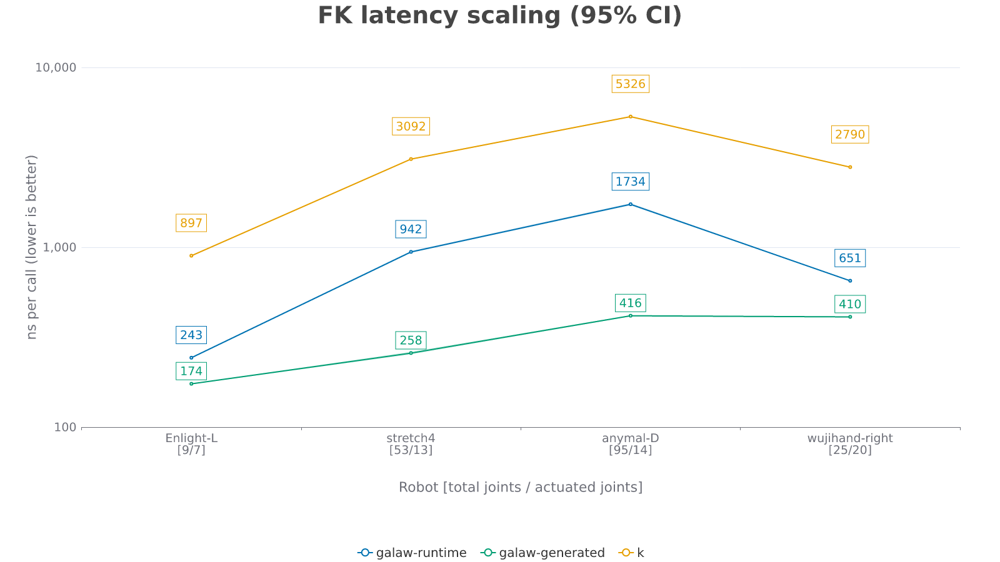
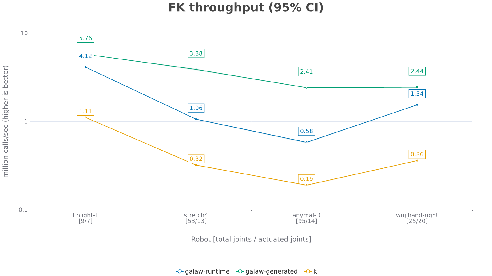
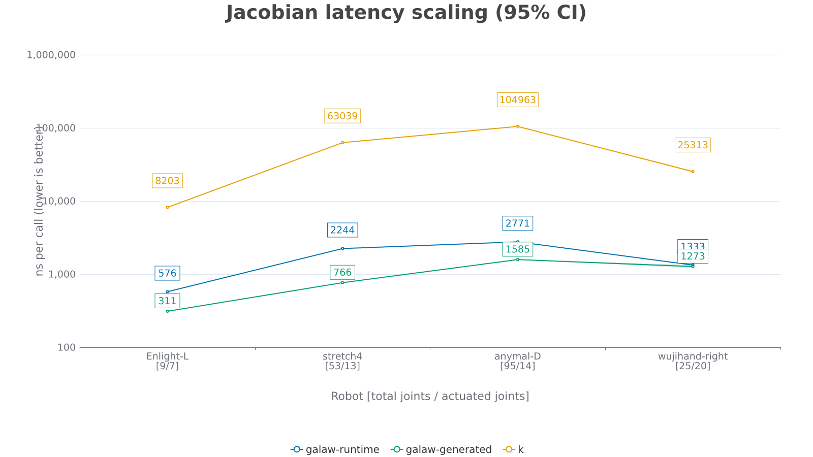
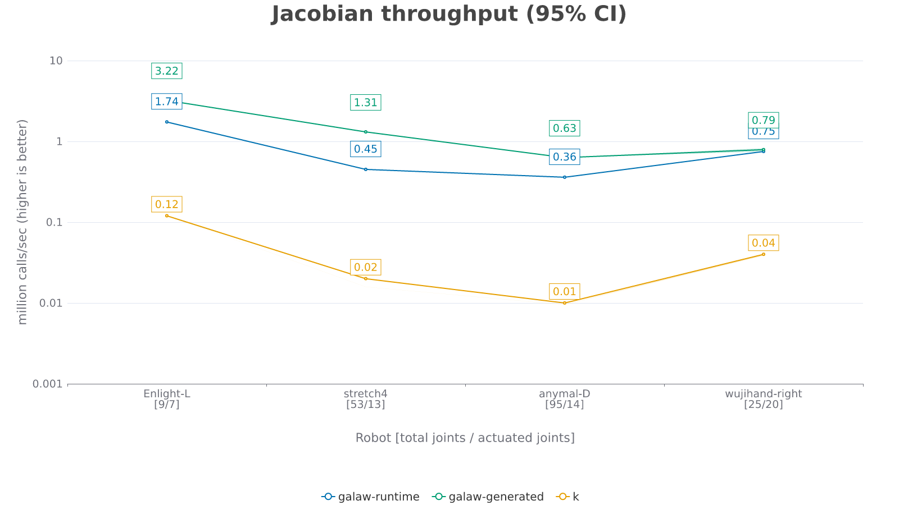
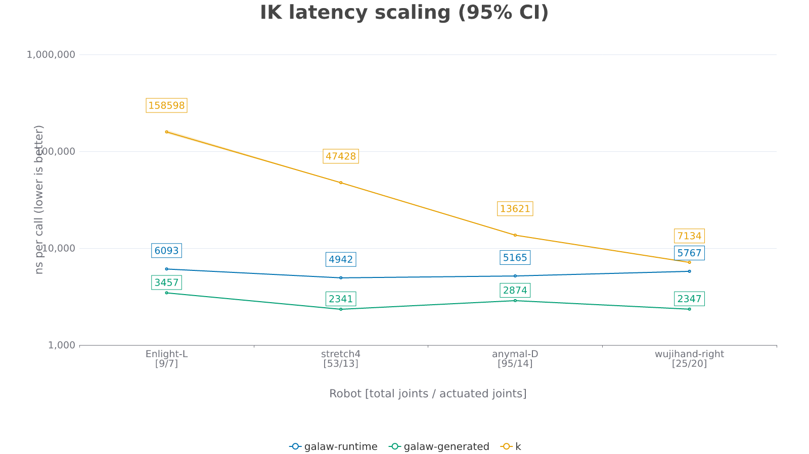
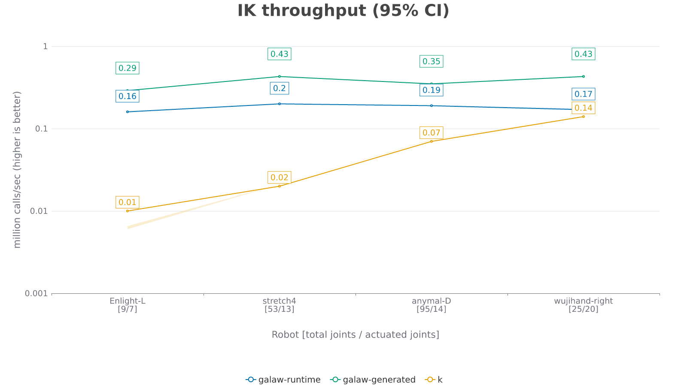

# `galaw` - A Rust-based kinematics library
*galaw* (pronounced gah-LOW, rhymes with "cow") is the Tagalog word that means movement or motion. This library is for computing kinematics.

## Features

- **Pre-allocated output buffers** — results are written into caller-owned `GalawData` (runtime) or `GeneratedGalawData` (generated) structs, eliminating per-call heap allocation. Allocate once, reuse across calls.
- **Code-generated (optional)** — ahead-of-time implementations per robot, with no parsing or `Result` on the hot path and fixed-size array types verified at compile time.
- **Correctness-tested** — FK checked against [`k`](https://crates.io/crates/k). Jacobian checked against finite differences. IK checked by round-tripping through FK.
- **Named lookups** — command joints/links by name, never by assumed index.
- **Descriptive errors** — malformed URDFs fail with a specific cause, not a panic.

## Quick Start

`galaw` has two APIs for each operation, with different performance/flexibility tradeoffs:

- **Runtime** — parses a URDF at runtime, works with *any* robot.
- **Generated** — ahead-of-time code generation, fixed to *one* robot at compile time. No parsing or `Result` handling on the hot path, with fixed-size array types that the compiler verifies.

### Runtime

```rust
use galaw::{error::GalawError, load_urdf, types::GalawModel};

fn main() -> Result<(), GalawError<f64>> {
    let model: GalawModel<f64> = load_urdf::<f64>("assets/urdf/custom/simple_arm_2dof.urdf")?;

    // Command each actuated joint by name — never by assumed position.
    let mut joint_cmds = vec![0.0_f64; model.num_actuated_joints];
    let shoulder_idx = model.get_joint_idx("shoulder_joint").expect("shoulder_joint exists in URDF");
    let elbow_idx = model.get_joint_idx("elbow_joint").expect("elbow_joint exists in URDF");
    let forearm_idx = model.get_link_idx("forearm").expect("forearm link exists in URDF");
    joint_cmds[shoulder_idx] = 0.5;
    joint_cmds[elbow_idx] = -0.3;

    // Allocate output buffers once — reuse across calls with no per-call heap allocation.
    let mut data = model.create_galaw_data();

    // Forward kinematics
    model.compute_fk(&joint_cmds, &mut data)?;

    // Jacobian — one 6×N matrix per link
    model.compute_link_jacobians(&joint_cmds, &mut data)?;

    // Inverse kinematics (damped Levenberg-Marquardt, clamps to joint limits)
    let target_pose = data.link_poses[forearm_idx];
    let init_cmds = vec![0.0_f64; model.num_actuated_joints];
    model.compute_ik(forearm_idx, &target_pose, &init_cmds, &mut data)?;

    println!("poses:    {:?}", data.link_poses[forearm_idx]);
    println!("jacobian:\n{}", data.link_jacobians[forearm_idx]);
    println!("solved:   {:?}", data.solved_joint_cmds);
    Ok(())
}
```

Full runnable version: [`examples/galaw_runtime.rs`](examples/galaw_runtime.rs) — `cargo run --example galaw_runtime`

### Generated

Ahead of time, generate fixed code for a specific robot (code for the robots shipped with this repo already exists under `src/generated/`, see `galaw::generated`):

```
# 1st arg: urdf_path, 2nd arg: out_path
cargo run --bin codegen_kinematics -- assets/urdf/custom/simple_arm_2dof.urdf src/generated/simple_arm_2dof.rs
```

Then call the generated functions directly:

```rust
use galaw::{error::GalawError, generated::simple_arm_2dof, load_urdf, types::{GalawModel, GeneratedGalawData}};

fn main() -> Result<(), GalawError<f64>> {
    // Load model only to resolve joint/link names to indices.
    let model: GalawModel<f64> = load_urdf::<f64>("assets/urdf/custom/simple_arm_2dof.urdf")?;
    let shoulder_idx = model.get_joint_idx("shoulder_joint").expect("shoulder_joint exists in URDF");
    let elbow_idx = model.get_joint_idx("elbow_joint").expect("elbow_joint exists in URDF");
    let forearm_idx = model.get_link_idx("forearm").expect("forearm link exists in URDF");

    // Fixed-size arrays — DOF count verified at compile time.
    let mut joint_cmds: [f64; 2] = [0.0; 2];
    joint_cmds[shoulder_idx] = 0.5;
    joint_cmds[elbow_idx] = -0.3;

    // Allocate output buffers once — stack-allocated, zero heap overhead.
    let mut data: GeneratedGalawData<f64, 2, 3> = GeneratedGalawData::new();

    // Forward kinematics
    simple_arm_2dof::compute_fk(&joint_cmds, &mut data);

    // Jacobian — fixed-size array of SMatrix<f64, 6, 2>, one per link
    simple_arm_2dof::compute_link_jacobians(&joint_cmds, &mut data);

    // Inverse kinematics
    let target_pose = data.link_poses[forearm_idx];
    let init_cmds: [f64; 2] = [0.0; 2];
    simple_arm_2dof::compute_ik(forearm_idx, &target_pose, &init_cmds, &mut data)?;

    println!("poses:    {:?}", data.link_poses[forearm_idx]);
    println!("jacobian:\n{}", data.link_jacobians[forearm_idx]);
    println!("solved:   {:?}", data.solved_joint_cmds);
    Ok(())
}
```

Full runnable version: [`examples/galaw_generated.rs`](examples/galaw_generated.rs) — `cargo run --example galaw_generated`

### Which one should I use?

**Runtime** if you need to support arbitrary URDFs at runtime (e.g. a robot chosen by a user, or loaded from a file you don't control at compile time). **Generated** if you know the robot ahead of time and want the fastest possible computation, at the cost of a codegen step and one generated file per robot.

## Performance

`galaw` outperforms [`k`](https://crates.io/crates/k) across all three operations (geometric mean across four robots). Benchmarked on: Intel Core i7-10750H @ 2.60GHz (6C/12T, boost up to 5.0GHz), 16GB RAM, Ubuntu 22.04.5 LTS (kernel 6.8).

| Operation | galaw-runtime vs k | galaw-generated vs k |
|-----------|-------------------|----------------------|
| FK        | ~3.5×             | ~8.6×                |
| Jacobian  | ~22.6×            | ~38.2×               |
| IK        | ~5.3×             | ~10.7×               |

Reproduce with `cargo bench`, then plot with:

```bash
cargo run --release --example plot_bench              # all three
cargo run --release --example plot_bench -- fk        # FK only
cargo run --release --example plot_bench -- ik        # IK only
cargo run --release --example plot_bench -- jacobian  # Jacobian only
```

### Forward Kinematics




### Jacobian




### Inverse Kinematics




## Citation

If you use `galaw` in your research, please cite it as:

```bibtex
@misc{malate2026galaw,
  author       = {Malate, Robert Jomar},
  title        = {galaw: A Rust-based kinematics library},
  year         = {2026},
  howpublished = {\url{https://github.com/RobJMal/galaw}},
}
```

## Attributions

This repository incorporates robot descriptions (URDF files) from various open-source projects. Each is used in compliance with its original license:

> **Note:** these robots' visual/collision mesh files (STL/DAE geometry) have been removed from this repo since `galaw` only parses a URDF's kinematic structure. The URDF files still reference `meshes/...` paths for compatibility with other tools. If the actual mesh geometry is needed, get it from the original project linked below.

* **Enlight-L (Flexiv)** – Derived from [flexiv_description](https://github.com/flexivrobotics/flexiv_description). Licensed under the **Apache License 2.0** (see `LICENSE` in the `Flexiv_Enlight-L` directory or the original notice for details). *Note: Modified locally to update mesh resource paths.*
  * *Local Changes:* Repackaged URDF into a flat `Flexiv_Enlight-L/` directory; modified mesh resource paths to be relative to `meshes/`; mesh files themselves removed (see note above).
  * *License Copy:* Located at `Flexiv_Enlight-L/LICENSE.md`
* **ANYmal D (ANYbotics)** – Derived from the [anymal_d_simple_description](https://github.com/ANYbotics/anymal_d_simple_description?tab=BSD-3-Clause-1-ov-file) project. Licensed under the **BSD 3-Clause License**.
  * *Local Changes:* Repackaged URDF into a flat `ANYbotics_ANYmal-D/` directory; modified mesh resource paths to be relative to `meshes/`; mesh files themselves removed (see note above).
  * *License Copy:* Located at `ANYbotics_ANYmal-D/LICENSE.md`
* **Wuji Hand (Wuji Technology)** – Derived from the [wuji-description](https://github.com/wuji-technology/wuji-description) project. Licensed under the **MIT License**.
  * *Local Changes:* Repackaged URDF into a flat `Wuji-Technology_Wuji-Hand/` directory; modified mesh resource paths to be relative to `meshes/`; mesh files themselves removed (see note above).
  * *License Copy:* Located at `Wuji-Technology_Wuji-Hand/LICENSE.md`
* **Stretch 4 (Hello Robot)** – Derived from the [stretch4_urdf](https://github.com/hello-robot/stretch4_urdf) project. Licensed under the **Clear BSD License**.
  * *Local Changes:* Repackaged URDF into a flat `Hello-Robot_Stretch4/` directory; modified mesh resource paths to be relative to `meshes/`; mesh files themselves removed (see note above).
  * *License Copy:* Located at `Hello-Robot_Stretch4/LICENSE.md`


Copies of the original licenses and any accompanying `NOTICE` files are preserved in the root directory or alongside the respective robot package folders.
